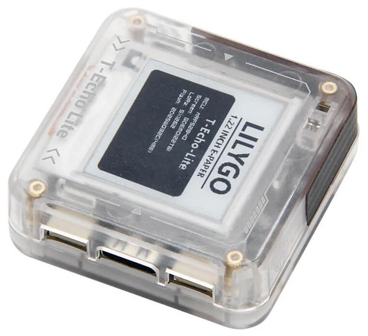
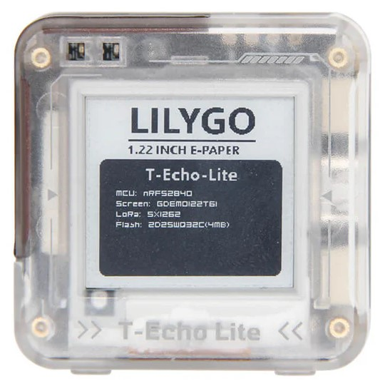
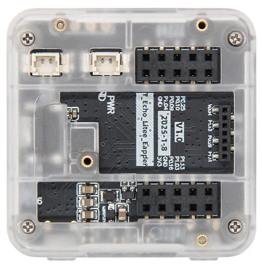
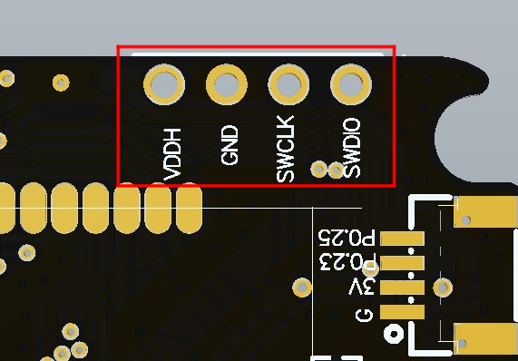
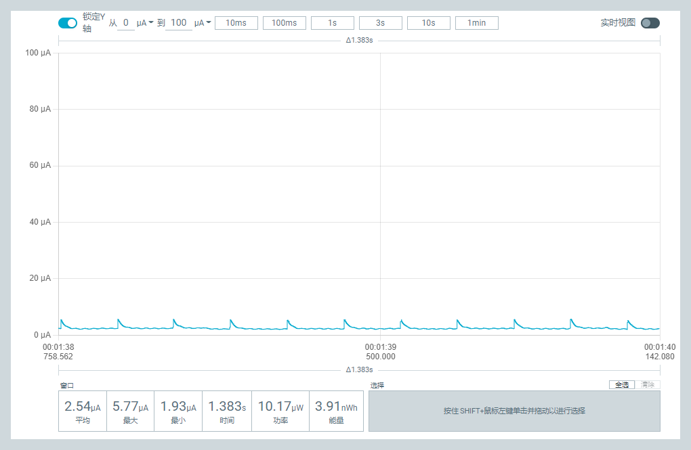
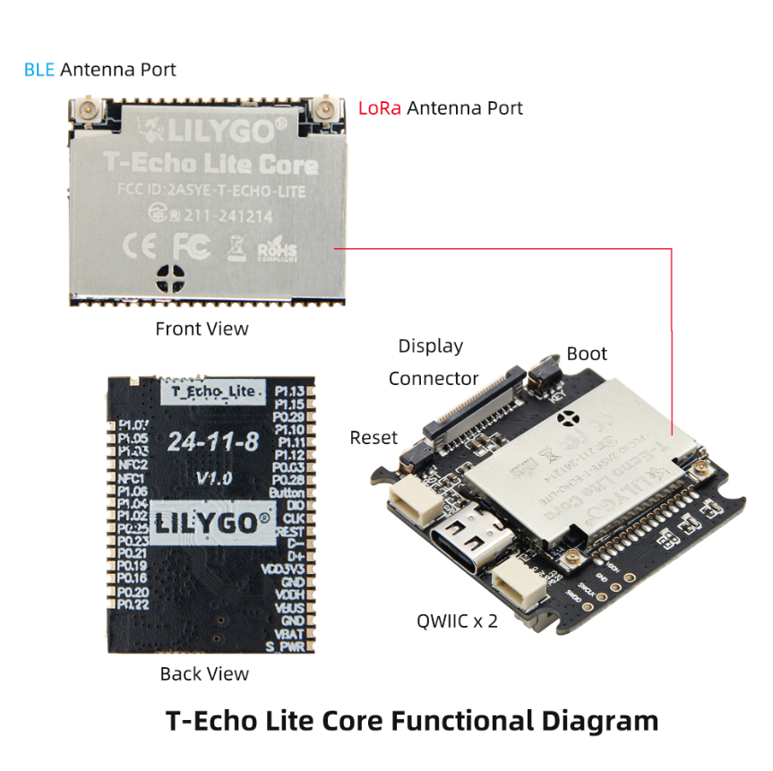

<!--
 * @Description: None
 * @Author: LILYGO_L
 * @Date: 2023-09-11 16:13:14
 * @LastEditTime: 2026-05-16 11:16:55
 * @License: GPL 3.0
-->

<h1 align = "center">T-Echo-Lite</h1>

    

## **[English](./README.md) | 中文**

## 版本迭代:
| Version                               | Update date                       |
| :-------------------------------: | :-------------------------------: |
| T-Echo-Lite_V1.0            | 2024-12-06                         |
| T-Echo-Lite-KeyShield_V1.0            | 2025-10-14                         |

## 购买链接
| Product                     | SOC           |  FLASH  |  RAM   | Link                   |
| :------------------------: | :-----------: |:-------: | :---------: | :------------------: |
| T-Echo-Lite_V1.0   | nRF52840 |   1M   |256kB| [LILYGO Mall](https://lilygo.cc/products/t-echo-lite?_pos=1&_sid=79b4c08e7&_ss=r&variant=45331277906101) |
| T-Echo-Lite-KeyShield_V1.0   |  |  || NULL |

## 目录
- [描述](#描述)
- [预览](#预览)
- [模块](#模块)
- [软件部署](#软件部署)
- [引脚总览](#引脚总览)
- [相关测试](#相关测试)
- [常见问题](#常见问题)
- [项目](#项目)

## 描述

T-Echo-Lite是基于T-Echo的轻便版本，拥有比T-Echo更小的体积，更小的功耗设计，最低深度睡眠功耗可达2μA-10μA（不同板子由于板载元器件差异功耗的表现可能不同，这里最低功耗采用LILYGO实验室测定的工程板），板载丰富的功能，惯性传感器、LORA模块、太阳能充电功能（5V）、外置GPS等功能，及其优秀的功耗表现使得T-Echo-Lite能够拥有更为出色的续航。

T-Echo-Lite-KeyShield为T-Echo-Lite的底板扩展，主要扩展了键盘、扬声器、麦克风、振动等外设。

> [!IMPORTANT]
> 重要说明：L76K模块和ICM20948模块属于外扩模块默认购买链接不提供这两个模块（其中ICM20948模块为焊接的方式连接，L76K模块为排针的方式连接），需要单独购买。

## 预览

### 实物图

    

---

    

---

    

## 模块

### T-Echo-Lite 部分
### 1. MCU

* 芯片：nRF52840
* RAM：256kB
* FLASH：1M
* 相关资料：
    >[nRF52840_Datasheet](https://docs.nordicsemi.com/bundle/ps_nrf52840/page/keyfeatures_html5.html)

### 2. 屏幕

* 名称：GDEM0122T61
* 尺寸：1.22 英寸
* 分辨率：176x192px
* 屏幕类型：E-PAPER
* 驱动芯片：SSD1681
* 总线通信协议：IIC
* 其他说明：不支持快刷（咨询屏厂后他们回复不支持），建议只使用全刷
* 依赖库：
    >[Adafruit_EPD](https://github.com/adafruit/Adafruit_EPD)  
    >[Adafruit_BusIO](https://github.com/adafruit/Adafruit_BusIO)  
    >[Adafruit_SPIFlash](https://github.com/adafruit/Adafruit_SPIFlash)  
    >[Adafruit-GFX-Library](https://github.com/adafruit/Adafruit-GFX-Library)
* 相关资料：
    >[GDEM0122T61](./information/GDEM0122T61.pdf)  
    >[SSD1681](./information/SSD1681.pdf)

### 3. LORA

* 芯片模组：S62F
* 芯片：SX1262
* 总线通信协议：SPI
* 依赖库：
    >[RadioLib](https://github.com/jgromes/RadioLib)  
    >[Adafruit_BusIO](https://github.com/adafruit/Adafruit_BusIO)  
    >[Adafruit_SPIFlash](https://github.com/adafruit/Adafruit_SPIFlash)
* 相关资料：
    >[S62F](./information/S62F.pdf)

### 4. GPS

* 芯片模组：L76K
* 总线通信协议：UART
* 依赖库：
    >[TinyGPSPlus](https://github.com/mikalhart/TinyGPSPlus)
* 相关资料：
    >[L76KB-A58](./information/L76KB-A58.pdf)

> [!IMPORTANT]
> 重要说明：L76K模块属于外扩模块默认购买链接不提供这这个模块，需要单独购买。

### 5. 惯性传感器

* 芯片：ICM20948
* 总线通信协议：IIC
* 依赖库：
    >[ICM20948_WE](https://github.com/wollewald/ICM20948_WE)
* 相关资料：
    >[ICM20948](./information/ICM20948.pdf)
    
> [!IMPORTANT]
> 重要说明：ICM20948模块属于外扩模块默认购买链接不提供这这个模块，需要单独购买。

### 6. Flash

* 芯片：ZD25WQ32CEIGR
* 总线通信协议：SPI
* 依赖库：
    >[Adafruit_BusIO](https://github.com/adafruit/Adafruit_BusIO)  
    >[Adafruit_SPIFlash](https://github.com/adafruit/Adafruit_SPIFlash)
* 相关资料：
    >[ZD25WQ32CEIGR](./information/ZD25WQ32CEIGR.pdf)

### T-Echo-Lite-KeyShield 部分
### 1. 键盘背光

* 驱动芯片：AW21009QNR
* 总线通信协议：IIC
* 依赖库：
    >[cpp_bus_driver](https://github.com/Llgok/cpp_bus_driver)
* 相关资料：
    >[AW21009QNR](./information/AW21009QNR.pdf)

### 2. 振动

* 驱动芯片：AW86224
* 总线通信协议：IIC
* 依赖库：
    >[cpp_bus_driver](https://github.com/Llgok/cpp_bus_driver)
* 相关资料：
    >[AW86224AFCR](./information/AW86224AFCR.pdf)

### 3. 扬声器麦克风

* 驱动芯片：ES8311
* 总线通信协议：IIC、IIS
* 依赖库：
    >[cpp_bus_driver](https://github.com/Llgok/cpp_bus_driver)
* 相关资料：
    >[ES8311](./information/ES8311.pdf)

### 4. 键盘

* 驱动芯片：TCA8418
* 总线通信协议：IIC
* 依赖库：
    >[cpp_bus_driver](https://github.com/Llgok/cpp_bus_driver)
* 相关资料：
    >[tca8418](./information/tca8418.pdf)

## 软件部署

### 示例支持

### T-Echo-Lite示例
| Example | `[Arduino IDE (Adafruit_nRF52_V1.6.1)]`   `[PlatformIO (nordicnrf52_V10.6.0)]`   Support | Description | Picture |
| ------  | ------  | ------ | ------ | 
| [Battery_Measurement](./examples/T-Echo-Lite/Battery_Measurement) | 
![alt text][supported]  |  |  |
| [BLE_Uart](./examples/T-Echo-Lite/BLE_Uart) | 
![alt text][supported]  |  |  |
| [Button_Triggered](./examples/T-Echo-Lite/Button_Triggered) | 
![alt text][supported]  |  |  |
| [Display](./examples/T-Echo-Lite/Display) | 
![alt text][supported]  |  |  |
| [Display_BLE_Uart](./examples/T-Echo-Lite/Display_BLE_Uart) | 
![alt text][supported]  |  |  |
| [Display_SX1262](./examples/T-Echo-Lite/Display_SX1262) | 
![alt text][supported]  |  |  |
| [Flash](./examples/T-Echo-Lite/Flash) | 
![alt text][supported]  |  |  |
| [Flash_Erase](./examples/T-Echo-Lite/Flash_Erase) | 
![alt text][supported]  |  |  |
| [Flash_Speed_Test](./examples/T-Echo-Lite/Flash_Speed_Test) | 
![alt text][supported]  |  |  |
| [GPS](./examples/T-Echo-Lite/GPS) | 
![alt text][supported]  |  |  |
| [GPS_Full](./examples/T-Echo-Lite/GPS_Full) | 
![alt text][supported]  |  |  |
| [ICM20948](./examples/T-Echo-Lite/ICM20948) | 
![alt text][supported]  |  |  |
| [IIC_Scan_2](./examples/T-Echo-Lite/IIC_Scan_2) | 
![alt text][supported]  |  |  |
| [nrf52840_module](./examples/T-Echo-Lite/nrf52840_module) | 
![alt text][supported]  |  |  |
| [Original_Test](./examples/T-Echo-Lite/Original_Test) |
![alt text][supported]  | 出厂测试程序 |  |
| [Sleep_Wake_Up](./examples/T-Echo-Lite/Sleep_Wake_Up) | 
![alt text][supported]  |  |  |
| [SX126x_PingPong](./examples/T-Echo-Lite/SX126x_PingPong) | 
![alt text][supported]  |  |  |
| [SX126x_PingPong_2](./examples/T-Echo-Lite/SX126x_PingPong_2) | 
![alt text][supported]  |  |  |
| [sx126x_tx_continuous_wave](./examples/T-Echo-Lite/sx126x_tx_continuous_wave) | 
![alt text][supported]  |  |  |

### T-Echo-Lite-KeyShield示例
| Example | `[Arduino IDE (Adafruit_nRF52_V1.6.1)]`   `[PlatformIO (nordicnrf52_V10.6.0)]`   Support | Description | Picture |
| ------  | ------  | ------ | ------ | 
| [aw21009qnr](./examples/T-Echo-Lite-KeyShield/aw21009qnr) | 
![alt text][supported]  |  |  |
| [aw86224](./examples/T-Echo-Lite-KeyShield/aw86224) | 
![alt text][supported]  |  |  |
| [es8311](./examples/T-Echo-Lite-KeyShield/es8311) | 
![alt text][supported]  |  |  |
| [original_test](./examples/T-Echo-Lite-KeyShield/original_test) | 
![alt text][supported]  | 出厂测试程序  |  |
| [tca8418](./examples/T-Echo-Lite-KeyShield/tca8418) | 
![alt text][supported]  |  |  |
| [voice_speaker](./examples/T-Echo-Lite-KeyShield/voice_speaker) | 
![alt text][supported]  |  |  |

[supported]: https://img.shields.io/badge/-supported-green "example"

| Bootloader | Description | Picture |
| ------  | ------  | ------ |
| [bootloader](./bootloader/) | |  |

| Firmware | Description | Picture |
| ------  | ------  | ------ |
| [T-Echo-Lite_Original_Test(lora_868mhz_125khz)](./firmware/[T-Echo-Lite_V1.0][Original_Test(lora_868mhz_125khz)]_firmware/)| 出厂测试程序 |  |
| [T-Echo-Lite_Original_Test(lora_915mhz_125khz)](./firmware/[T-Echo-Lite_V1.0][Original_Test(lora_915mhz_125khz)]_firmware/)| 出厂测试程序 |  |
| [T-Echo-Lite-KeyShield_original_test](./firmware/[T-Echo-Lite-KeyShield_V1.0][original_test]_firmware/)| 出厂测试程序 |  |

### IDE和烧录

#### PlatformIO
1. 安装 [VisualStudioCode](https://code.visualstudio.com/Download)，根据你的系统类型选择安装。

2. 打开VisualStudioCode软件侧边栏的“扩展”（或者使用<kbd>Ctrl</kbd>+<kbd>Shift</kbd>+<kbd>X</kbd>打开扩展），搜索“PlatformIO IDE”扩展并下载。

3. 在安装扩展的期间，你可以前往GitHub下载程序，你可以通过点击带绿色字样的“<> Code”下载主分支程序，也通过侧边栏下载“Releases”版本程序。

4. 扩展安装完成后，打开侧边栏的资源管理器（或者使用<kbd>Ctrl</kbd>+<kbd>Shift</kbd>+<kbd>E</kbd>打开），点击“打开文件夹”，找到刚刚你下载的项目代码（整个文件夹），点击“添加”，此时项目文件就添加到你的工作区了。

5. 打开项目文件中的“platformio.ini”（添加文件夹成功后PlatformIO会自动打开对应文件夹的“platformio.ini”）,在“[platformio]”目录下取消注释选择你需要烧录的示例程序（以“default_envs = xxx”为标头），然后点击左下角的“<kbd>[√](image/4.png)</kbd>”进行编译，如果编译无误，将单片机连接电脑，点击左下角“<kbd>[→](image/5.png)</kbd>”即可进行烧录。

6. 此时可能会报错，你需要安装一个 [Python](https://www.python.org/downloads/) ，依次打开文件夹“tool”->“win10 vscode platformio start”，在“win10 vscode platformio start”文件夹下执行cmd命令`python t-echo-lite_v1.0.0_setup.py`，即可完成开发板安装，此时编译烧录就不会报错了。

#### Arduino
1. 安装 [Arduino](https://www.arduino.cc/en/software)，根据你的系统类型选择安装。

2. 打开项目文件夹的“example”目录，选择示例项目文件夹，打开以“.ino”结尾的文件即可打开Arduino IDE项目工作区。

3. 打开右上角“工具”菜单栏->选择“开发板”->“开发板管理器”，找到或者搜索“Adafruit_nRF52”，下载作者名为“Adafruit”的开发板文件。接着返回“开发板”菜单栏，选择“Adafruit_nRF52”开发板下的开发板类型，选择的开发板类型由“platformio.ini”文件中以[env]目录下的“board = xxx”标头为准，如果没有对应的开发板，则需要自己手动添加项目文件夹下“board”目录下的开发板。(如果找不到“Adafruit_nRF52”，则需要打开首选项 -> 添加 “https://www.adafruit.com/package_adafruit_index.json” 到“其他开发板管理地址”)

4. 打开菜单栏“[文件](image/6.png)”->“[首选项](image/6.png)”，找到“[项目文件夹位置](image/7.png)”这一栏，将项目目录下的“libraries”文件夹里的所有库文件连带文件夹复制粘贴到这个目录下的“libraries”里边。

5. 在 "工具 "菜单中选择正确的设置，如下表所示。

| Setting                               | Value                                 |
| :-------------------------------: | :-------------------------------: |
| Board                                 | Nordic nRF52840 DK           |

6. 选择正确的端口。

7. 开启引导下载模式：按一下RST芯片复位按键后松开等待LED1亮后（一定要等待LED1亮）再按一下RST按键后松开，观察到LED1灯逐渐熄灭逐渐点亮，即已进入引导下载模式。

8. 点击右上角“<kbd>[√](image/8.png)</kbd>”进行编译，如果编译无误，将单片机连接电脑，点击右上角“<kbd>[→](image/9.png)</kbd>”即可进行烧录。

#### JLINK烧录firmware和bootloader
1. 安装软件 [nRF-Connect-for-Desktop](https://www.nordicsemi.com/Products/Development-tools/nRF-Connect-for-Desktop/Download#infotabs)

2. 安装软件 [JLINK](https://www.segger.com/downloads/jlink/)

3. 正确连接JLINK引脚如下图

    

4. 打开软件nRF-Connect-for-Desktop 安装工具 [Programmer](./image/10.png) 并打开

5. 添加文件，同时选择bootloader文件和firmware文件，点击 [Erase&write](./image/11.png) ，即可完成烧录

## 引脚总览

引脚定义请参考配置文件：
 

[t_echo_lite_config.h](./libraries/private_library/t_echo_lite_config.h)  
[t_echo_lite_keyshield_config.h](./libraries/private_library/t_echo_lite_keyshield_config.h)

## 相关测试

### 功耗
| Firmware | Software| Description | Picture |
| ------  | ------  | ------ | ------ | 
| [Sleep_Wake_Up](./firmware/[T-Echo-Lite_V1.0][Sleep_Wake_Up]_firmware/[T-Echo-Lite_V1.0][Sleep_Wake_Up]_firmware_202412040900.hex)   [Sleep_Wake_Up(uf2)](./firmware/[T-Echo-Lite_V1.0][Sleep_Wake_Up]_firmware/[T-Echo-Lite_V1.0][Sleep_Wake_Up]_firmware_202412040900.uf2) | `Sleep_Wake_Up` | 最低功耗: 2.54uA   更多信息请查看 [功耗测试日志](./relevant_test/PowerConsumptionTestLog_[T-Echo-Lite_V1.0]_20241210.pdf) | 
  
 |

## 常见问题

* Q. 看了以上教程我还是不会搭建编程环境怎么办？
* A. 如果看了以上教程还不懂如何搭建环境的可以参考[LilyGo-Document](https://github.com/Xinyuan-LilyGO/LilyGo-Document)文档说明来搭建。

 

* Q. 为什么打开Arduino IDE时他会提醒我是否要升级库文件？我应该升级还是不升级？
* A. 选择不升级库文件，不同版本的库文件可能不会相互兼容所以不建议升级库文件。

 

* Q. 为什么我的板子USB输出不任何调试信息
* A. 请打开串口助手软件中的“DTR”选项

 

* Q. 为什么我直接使用USB烧录板子一直烧录失败呢？
* A. 请按一下RST芯片复位按键后松开等待LED1亮后（一定要等待LED1亮）再按一下RST按键后松开，观察到LED1灯逐渐熄灭逐渐点亮，即已进入引导下载模式，这时候就能烧录了。

 

* Q. T-Echo-Lite模块的蓝牙天线和Lora天线应该如何区分呢？
* A. T-Echo-Lite模块的蓝牙天线和Lora天线如下图所示：

    

 

## 项目
* [T-Echo-Lite_V1.0](./project/T-Echo-Lite_V1.0/T-Echo-Lite_V1.0.pdf)
* [T-Echo-Lite-Eapper_V1.0](./project/T-Echo-Lite_V1.0/T-Echo-Lite-Eapper_V1.0.pdf)

